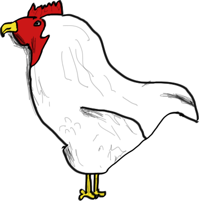

# chicken-php

PHP implementation of the [Chicken VM](http://torso.me/chicken), ported from
JavaScript.

What is Chicken? It's a language based around one single symbol: `chicken`.
Actually, there are a few tokens: `chicken`, space and newline. The chicken
count of a line corresponds to an opcode.

It roughly translates into a form of assembly. The supported operations are
`chicken` (string), `+`, `-`, `*`, `==`, load, store, jump, chars and literal
numbers.

The memory model has pointers to the stack itself and input as the first two
elements of the stack. Those are followed by the opcodes, delimited by 0. The
opcodes then run until the 0 is reached, at which point the head of the stack
is returned. Every operation consumes one or more elements, then pushes its
result onto the stack.

The reference implementation is written in JavaScript and is a piece of art.

## Usage

### `chicken`

Low-level chicken interpreter.

Quine:

    $ echo chicken | bin/chicken

Cat:

    $ echo chicken | bin/chicken foo <<EOF
    chicken chicken chicken chicken chicken chicken chicken chicken chicken chicken chicken
    chicken chicken chicken chicken chicken chicken

    EOF

### `eggsemble`

Eggsembler. Compiles down to chicken.

Print `A`:

    $ (bin/eggsemble | bin/chicken) <<EOF
    push 5
    push 13
    rooster
    bbq
    axe
    EOF
